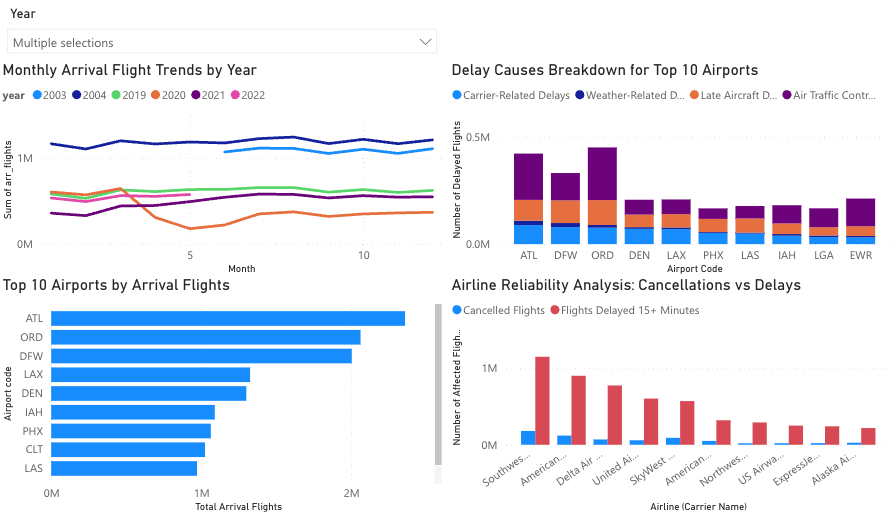

# Airline Delay Cause Analytics (AWS + PySpark)

End-to-end **cloud-based big data analytics pipeline** using **AWS (S3, EC2, IAM, SNS, Lambda/SSM optional)** and **PySpark** to ingest, process, analyze, and store airline delay data for downstream analytics and dashboards.

## Project Overview
This project builds a production-style data pipeline:
- Ingest raw airline delay data from **Amazon S3**
- Process and feature-engineer using **PySpark** on **EC2**
- Write processed outputs back to **S3** in **CSV + Parquet**
- Run analytics using **Spark SQL**
- Optional automation with **Lambda + SSM + SNS notifications**
- Dashboarding via **Power BI** (QuickSight attempted, fallback due to Free Tier limitations)

## Dataset
**Airline Delay Cause Dataset** (multi-year flight performance data).  
Key fields: `year, month, airport, carrier, arr_flights, arr_del15, cancellations/diversions, delay causes` (carrier/weather/NAS/security/late aircraft).

> Note: This repo contains only a small sample for demo. Full dataset should be stored in S3.

## Architecture
1. **S3 (raw + processed)** stores the dataset and outputs
2. **EC2 (Linux)** runs PySpark jobs for processing/analytics
3. **PySpark** performs cleaning, feature engineering, aggregation
4. **Spark SQL** runs analytical queries (top carriers, trends, etc.)
5. **SageMaker Canvas** used for no-code model training & evaluation
6. **Power BI** dashboard created from processed dataset (alternative to QuickSight)


## Features Implemented
### Data Processing (PySpark)
- Drop missing values
- Feature engineering:
  - `total_delay_minutes` = sum of individual delay minutes
  - `total_delay_count` = sum of delay counts
- Aggregations:
  - Total delay minutes by carrier
  - Avg delay minutes by airport
  - Yearly + monthly delay trends
  - Avg delay minutes per carrier

### Storage
- Output formats:
  - **Parquet** (optimized analytics)
  - **CSV** (BI-friendly)
- Organized S3 structure:
  - `raw/`, `processed/`, `analytics/logs/`

### Analytics (Spark SQL)
- Total arrival delay by carrier
- Avg arrival delay by airport
- Yearly / monthly trends
- Flight volume by carrier

### Automation
- `pipeline/run_pipeline.sh` runs the pipeline end-to-end
- Optional scheduling:
  - Lambda + SSM trigger
  - SNS email notifications on success/failure
  - Cron option available

## Repo Structure
- `src/` PySpark ETL + SQL analytics
- `pipeline/` run scripts + configs
- `data/sample/` small input for local run
- `outputs/` sample outputs
- `docs/` report + architecture + screenshots

## Quickstart (Local)
```bash
python -m venv .venv
source .venv/bin/activate
pip install -U pip pyspark

python src/transform_airline.py \
  --input data/sample/Airline_Delay_Cause_sample.csv \
  --output outputs/local
```

## Results & Insights
Dashboards highlight:
- Monthly flight trends by year (COVID impact visible)
- Top airports by arrival volume
- Delay cause breakdowns
- Airline reliability (cancellations vs delays)
- Airport traffic volume vs delay frequency

## Power BI Dashboard

Due to Power BI tenant sharing restrictions, the interactive dashboard cannot be publicly embedded.
Below are preview snapshots of the dashboard.



## Report
Full report is available in: `docs/MiniProject_Report.pdf`

## License
MIT License

